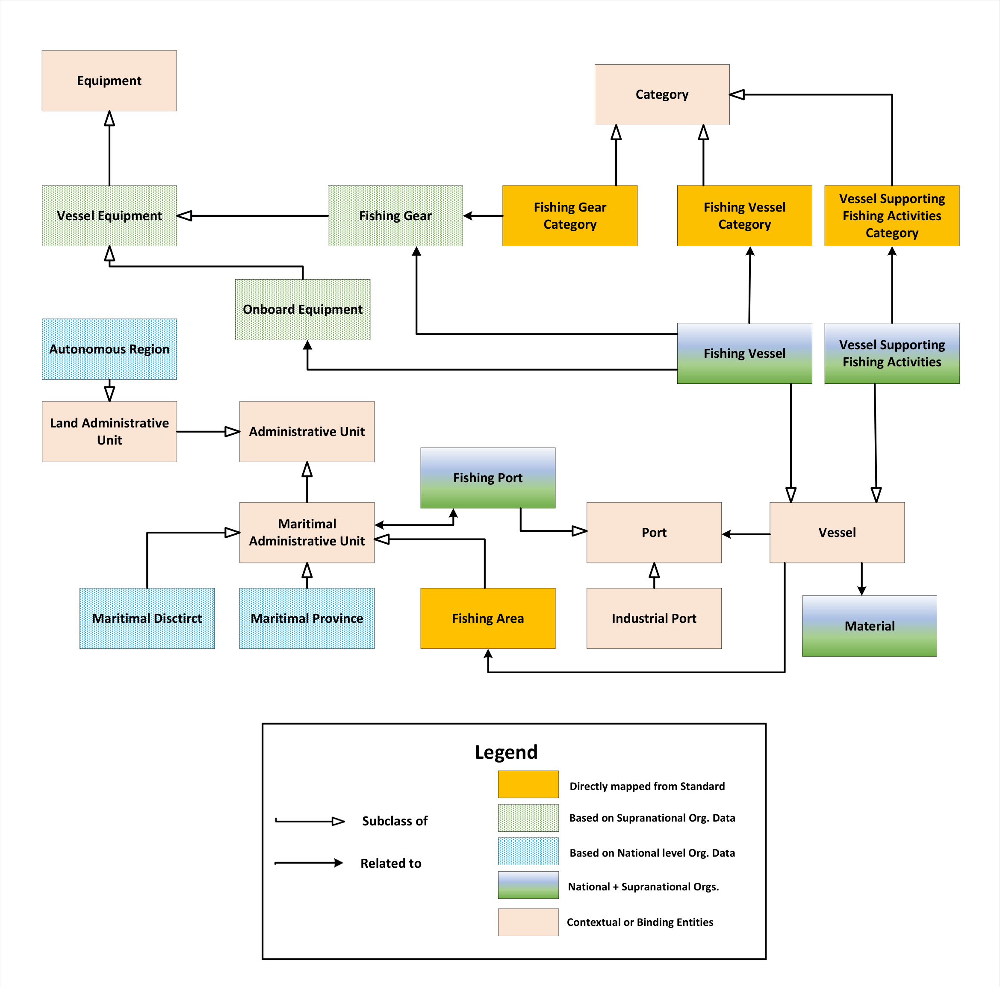

# EFFKG

This repository contains all supplementary materials — including datasets, source code, and validation artefacts — associated with the paper:

**A Cross-Source Semantic Dataset for Maritime Fleet Data Integration in the European Blue Economy**

Submitted to [Scientific Data](https://www.nature.com/sdata/)

The **European Fishing Fleet Knowledge Graph (EFFKG)** is a semantic dataset integrating heterogeneous maritime data originating from multiple institutional layers, including international standards, European registries, and national administrative sources, within a unified semantic framework. All integrated resources were obtained from publicly accessible repositories. The knowledge graph is also deployed as a public Wikibase instance at [effkg.wikibase.cloud](https://effkg.wikibase.cloud/wiki/Main_Page).

The dataset is additionally archived on [Zenodo]()

## Table of Contents

- [Original Sources](#original-sources)
- [Knowledge Graph Scope and Data Model](#knowledge-graph-scope-and-data-model)
- [Dataset Versioning, Licensing, and Statistics](#dataset-versioning-licensing-and-statistics)
- [Reproducibility](#reproducibility)
- [Repository Structure](#repository-structure)
- [Intended Audience](#intended-audience)
- [Contact](#contact)

## Original Sources

The primary data sources included in the current release are grouped as follows:

* **Source categories**
  * **International standards and global datasets**
    * International Standard Statistical Classification of Fishery Vessels by Vessel Types (ISSCFV)
    * International Standard Statistical Classification of Fishing Gear (ISSCFG)
    * FAO Major Fishing Areas
    * World Port Index (WPI), providing globally standardised port identifiers and geospatial information
  * **Supranational data sources**
    * European Fleet Register, providing comprehensive coverage of the European fishing fleet, including technical and administrative vessel information
    * Official Journal of the European Union, providing regulatory and classification references
    * European port infrastructure dataset derived from aggregated national sources
  * **National data sources**
    * Spanish General Register of the Fishing Fleet (*Registro General de la Flota Pesquera*, Spain)
    * *Boletín Oficial del Estado* (BOE, Spain)
    * Instituto Geográfico Nacional (IGN) — SIGNA platform (Spain)

* **Document formats**: `.csv` and `.xlsx` files (e.g., vessels, ports, fishing areas), together with additional formats such as PDF and XML.
* **Geographical scope**: Europe
* **Temporal coverage**: 2005–2025
* **Languages**: English and Spanish

The integrated sources contain documentary and administrative records describing the European fishing fleet, maritime infrastructures, administrative divisions, and regulatory or international classification systems. Several sources required extensive preprocessing in order to generate machine-actionable semantic representations.

## Knowledge Graph Scope and Data Model

The dataset covers the European fishing fleet and selected components of the associated maritime infrastructure. Vessel entities are primarily derived from the European Fleet Register, which serves as the reference source to ensure comprehensive coverage of active fishing vessels at the European level.

Additional information from national administrative sources is incorporated to enrich vessel descriptions with attributes not available in supranational datasets. In the current release, detailed national-level data from Spain are included to provide extended information regarding vessel identifiers, administrative status, and operational context. These datasets are integrated as complementary semantic layers aligned with the European reference framework.

Maritime infrastructure is represented through the integration of port entities and administrative units. Port information is primarily derived from the World Port Index and complemented with European and national datasets in order to account for regional naming conventions and spatial heterogeneity.

Entities are incorporated based on their presence in at least one authoritative source and their compatibility with the unified semantic model. When multiple datasets describe the same real-world entity, records are reconciled and semantically integrated.

The dataset and its data model is designed to support incremental extension through the incorporation of additional national datasets and maritime-related domains. The current version data model:

## Dataset Versioning, Licensing, and Statistics

### Version Information

* **Current version**: v1.0.0
* **Release date**: 15/05/2026
* **Last update**: 15/05/2026

### Licensing

* **Dataset license**: The dataset is distributed under the *Creative Commons Attribution 4.0 International (CC BY 4.0)* license.
* **Code license**: The source code included in this repository is distributed under the *MIT License*.

Users must comply with the corresponding licensing conditions when reusing either the data or the software components.

### Statistics (v1.0.0)

* Number of vessel entities: 188,170
* Number of port entities: 1,997
* Number of administrative units: 269
* Number of category entities: 73
* Total number of entities: 190,628
* Total number of statements: 3,707,656
* Total number of provenance references: 4,033,845
* Number of integrated data sources: 13

### Version History

**v1.0.0 (current release)**  
- Initial public release of the dataset.

## Reproducibility

This repository provides all artefacts required to:

* Inspect the JSON and RDF datasets generated from the integrated maritime sources.
* Reproduce the CSV-to-Wikibase ingestion workflow.
* Examine validation constraints (ShEx / EntitySchemas).
* Re-execute SPARQL-based analyses.

The JSON and RDF datasets provided in this repository correspond to the data ingested into the public Wikibase instance (v1.0.0). Together, the live EFFKG deployment and this repository ensure full reproducibility of the knowledge graph population workflow.

## Repository Structure

* **code**: Contains Jupyter notebooks implementing the main components of the population pipeline. The notebooks can be grouped into the following categories:
   * **Web scrapers**: Recover information from sources lacking APIs or structured access mechanisms.
   * **Data consolidators**: Integrate heterogeneous source datasets into unified intermediate representations.
   * **Wikibase utilities**: Support data import/export operations and statistical extraction from Wikibase instances.
   * **Validation utilities**: Infer and validate the structural organisation of the knowledge graph.
   
* **dataset**: Contains JSON and RDF datasets (Turtle format) generated by applying the proposed integration pipeline to the original data sources.

* **schema**: Contains the Shape Expressions defining the entity structure of the dataset.

* **source_data**: Contains original and preprocessed source data prepared for data consolidation and knowledge graph population.

* **data_model**: Contains the current data model and its sources and interactions.

* **validation**: Contains the outputs from the validation process, including the inferred schema for the structural validation.

## Intended Audience

The EFFKG is intended for:

* Blue Economy stakeholders, including researchers, policy makers, and maritime organisations.
* Semantic Web and Knowledge Graph researchers.
* The general public, as the dataset is derived from publicly accessible institutional resources.

## Contact

The EFFKG was developed by the [WESO Research Group](https://www.weso.es/).

Responsible researchers:

* **Enrique Rodriguez-Martin**, Universidad de Oviedo
* **Jorge Álvarez-Fidalgo**, Universidad de Oviedo
* **Manuel Luna**, Universidad de Oviedo
* **Jose Emilio Labra-Gayo**, Universidad de Oviedo

For inquiries, collaboration proposals, or technical issues, contact:  
`rodriguezmenrique@uniovi.es`

Alternatively, open an issue in this repository.
